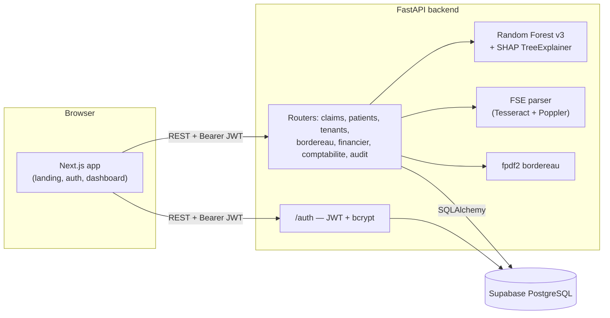

# SihaIQ

**Claim-rejection prediction and revenue-cycle management (RCM) for Moroccan private hospitals.** It scores each insurance claim *before* it is sent to CNOPS, CNSS or FAR and explains the score in French.

> Portfolio / MVP project. All data in this repository and in the demo is **synthetic**. No real patient data is used.

---

## The problem

Moroccan private clinics bill most of their activity to mandatory health-insurance bodies (CNOPS, CNSS, which also manages AMO and AMO-Tadamon under Loi 54-23, and FAR). Two things cost them recoverable revenue:

- **Claim rejections.** A dossier is refused for coding, document or eligibility problems. Most problems are found only *after* the payer answers, when fixing them costs weeks.
- **Forclusion.** A dossier that isn't submitted within the payer deadline (tracked by SihaIQ as **60 days after the service date**) can no longer be reimbursed.

The billing office (*BAF, Bureau d'Admission et de Facturation*) usually tracks both in spreadsheets.

## What SihaIQ does

| Area | What's implemented |
|---|---|
| **Claim intake** | Three entry paths that all create the same claim record, keyed on the hospital's *Numéro d'Entrée* (NE): manual form, CSV import, and OCR scan of a hospitalisation document (Tesseract, French). The agent checks the OCR result before saving. |
| **Rejection-risk scoring** | Every new claim is scored automatically by a Random Forest model. It gets a risk level (FAIBLE / MODÉRÉ / ÉLEVÉ), a danger/safe alert at threshold 0.40, the top-3 SHAP factors and a French recommendation. A *Prédiction IA* page simulates a claim without saving it. |
| **Outcome feedback loop** | When an agent records the payer's answer (approved, rejected, contested, settled, closed, abandoned), a labelled row is written to `training_feedback` for future retraining. |
| **Forclusion & A/R aging** | Deadline tracking with urgency levels; the *Encours* page sorts receivables into 0–30 / 31–45 / 46–55 / 56–60 days / forclos. |
| **Bordereau PDF** | Generates a transmission slip (PDF) for a selection of claims to one payer. |
| **Dashboards** | Overview KPIs, per-payer performance, a financial dashboard (admin/director only) and a hospital-accounting (*comptabilité DAF*) module with manual data entry. |
| **Multi-tenant SaaS basics** | Hospital sign-up, user/agent management with roles, audit log, tenant isolation via the JWT. |
| **Privacy by design** | Patients are identified only by NE. CIN and insurance numbers, if entered, are stored as salted SHA-256 hashes. CSV files containing name/CIN columns are refused. Scanned documents are deleted right after OCR. |

**Work in progress:** password reset by email, batch (CSV) prediction on the *Prédiction IA* page, demo-data seeding during onboarding. See the [roadmap](#roadmap).

## Screenshots

| Dashboard | Claims (dossiers) | AI prediction |
|---|---|---|
|  |  |  |

*Placeholders: see [docs/img/README.md](docs/img/README.md).*

## Architecture



More detail in [docs/ARCHITECTURE.md](docs/ARCHITECTURE.md).

## Tech stack

| Layer | Technology |
|---|---|
| Frontend | Next.js 16 (App Router), React 19, TypeScript, Tailwind CSS 4, GSAP 3; Chart.js 4 loaded from a CDN on the landing page |
| Backend | FastAPI, SQLAlchemy 2, Pydantic 2, python-jose (JWT HS256), passlib/bcrypt |
| Database | PostgreSQL on Supabase |
| ML | scikit-learn 1.6.1 Random Forest, SHAP (TreeExplainer), pandas/numpy, joblib |
| OCR / documents | pytesseract + Tesseract (`fra`), pdf2image + Poppler, Pillow, fpdf2 |

## ML approach

- **Model:** `RandomForestClassifier` with 200 trees, `max_depth=6` and `class_weight="balanced"`. The artifact is [`backend/app/ml/models/sihaiq_rf_v3.joblib`](backend/app/ml/models/).
- **Inputs:** 7 columns built from 5 claim fields: `duree_sejour` (length of stay), `montant_total`, `part_organisme` (share paid by the payer), `mois` (month), and the payer one-hot-encoded as `org_CNOPS` / `org_CNSS` / `org_FAR`. AMO and AMO-Tadamon are mapped to CNSS, which manages them.
- **Outputs:** rejection probability; display zones FAIBLE < 0.40 ≤ MODÉRÉ < 0.70 ≤ ÉLEVÉ; separate decision threshold **0.40** (recall-first); top-3 SHAP contributions with a French action message.
- **Results:** AUC and other evaluation metrics: `TODO: verify` (the training notebook will be added to `notebooks/`).
- **History:** an earlier XGBoost version is archived in [`backend/app/ml/_archive/`](backend/app/ml/_archive/) and isn't loaded by the app.

Full details: [docs/ML.md](docs/ML.md).

## Data & compliance

- **Synthetic data only.** The model was trained on a synthetic dataset, and no real patient record is in this repository.
- **Loi 09-08 (CNDP).** The data model avoids direct identifiers: patients exist only as a hospital NE number, an age bucket and payer flags. CIN and immatriculation are hashed and never stored in clear. The CSV import refuses files that contain name or CIN columns. OCR uploads are written to a temp file and deleted in a `finally` block.
- **Payers:** CNOPS, CNSS (including AMO and AMO-Tadamon, Loi 54-23) and FAR.

## Local setup (Windows, Anaconda, no Docker)

**Prerequisites:** Anaconda, Node.js 20+, a Supabase (or any PostgreSQL) database, and for OCR only: [Tesseract](https://github.com/UB-Mannheim/tesseract/wiki) with the French language pack plus [Poppler](https://github.com/oschwartz10612/poppler-windows) on `PATH`.

**Backend**

```powershell
cd backend
conda create -n rcm-saas python=3.11 -y
conda activate rcm-saas
pip install -r requirements.txt
copy .env.example .env      # then fill in the values
uvicorn app.main:app --reload
```

The API runs on `http://localhost:8000` (interactive docs at `/docs`). On startup it creates the ORM tables. The tables queried with raw SQL (`training_feedback`, `audit_logs`, `acc_*`) must already exist; see [docs/DATA_MODEL.md](docs/DATA_MODEL.md).

> The OCR parser expects Tesseract at `C:\Program Files\Tesseract-OCR\tesseract.exe`.

**Frontend**

```powershell
cd frontend
npm install
copy .env.example .env.local   # NEXT_PUBLIC_API_URL=http://localhost:8000
npm run dev
```

Open `http://localhost:3000` and create a hospital account from the register page.

## Environment variables

| Variable | Where | Required | Description |
|---|---|---|---|
| `DATABASE_URL` | backend | yes | PostgreSQL connection string |
| `SECRET_KEY` | backend | yes | JWT signing key; startup fails if missing |
| `ALLOWED_ORIGINS` | backend | yes | Comma-separated CORS origins; startup fails if missing |
| `ALGORITHM` | backend | no | JWT algorithm (default `HS256`) |
| `ACCESS_TOKEN_EXPIRE_MINUTES` | backend | no | Token lifetime (default `480`) |
| `NEXT_PUBLIC_API_URL` | frontend | yes | Base URL of the backend |

## Project structure

```
backend/
  app/
    main.py              FastAPI app, CORS, router registration
    config.py            Environment settings (fail-fast)
    database.py          SQLAlchemy engine / session
    api/                 Routers: auth, claims, patients, tenants, bordereau,
                         financier, comptabilite, audit
    models/              ORM: tenant, user, patient, claim, claim_act
    schemas/             Pydantic request/response models
    ml/
      features.py        Claim → model input encoding
      models/            sihaiq_rf_v3.joblib + feature order (active)
      _archive/          Earlier XGBoost versions (not loaded)
      calibration_percentiles.sql   Queries to recalibrate the zones later
    services/
      fse_parser.py      OCR extraction of the 5 model fields
  requirements.txt
  Dockerfile             Not used in the current Windows/conda workflow
frontend/
  app/
    page.tsx             Landing page
    auth/                login, register, forgot/reset password
    onboarding/          First-run screen after sign-up
    dashboard/           Overview + dossiers, patients, prediction, forclusion,
                         encours, performance, financier, comptabilite, audit, settings
    legal/               CNDP, terms, privacy, accessibility, sitemap
docs/                    Architecture, API, ML, data model, changelog, research notes
```

## Roadmap

**Done**
- Multi-tenant auth (JWT), roles, agent management, audit log
- Claim intake: manual, CSV, OCR scan, all keyed on NE
- Random Forest v3 scoring with SHAP explanations; standalone prediction page
- Status workflow (6 outcomes) feeding `training_feedback`
- Forclusion tracking, A/R aging, performance, financial and accounting dashboards
- Bordereau PDF generation
- Landing page and legal pages

**In progress**
- Retraining pipeline that consumes `training_feedback` (rows are being collected)
- Training notebook and verified evaluation metrics in `notebooks/`
- Password reset by email (WIP)
- Batch CSV prediction on the prediction page (WIP)
- Onboarding demo-data seeding (WIP)
- Automated tests and schema migrations

## Author

**Mohamed** — design and development. <!-- TODO: add LinkedIn / GitHub links -->

## License

Private — SihaIQ © 2026. All rights reserved. <!-- TODO: confirm license before making the repo public -->
