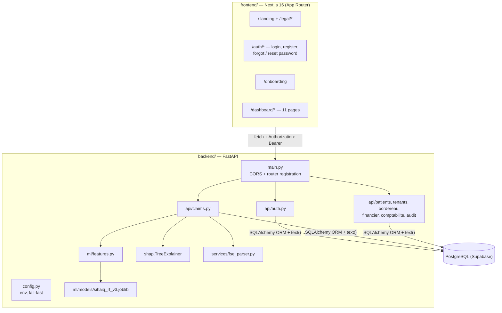
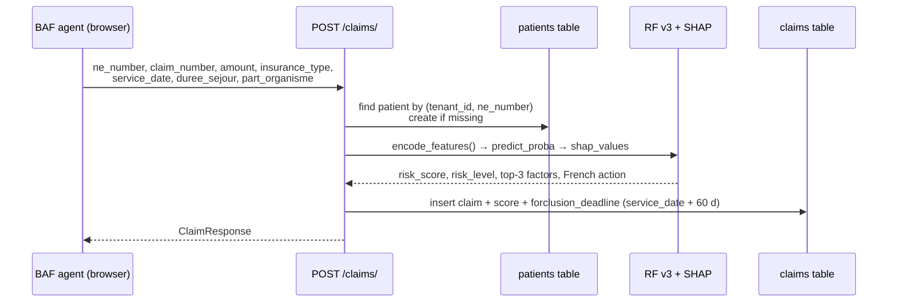

# Architecture

SihaIQ is a two-tier web application: a Next.js single-page front end that calls a FastAPI REST backend, which owns all business logic, ML inference and database access (PostgreSQL on Supabase).

## Components

| Component | Responsibility |
|---|---|
| `backend/app/main.py` | Loads `.env`, creates ORM tables (`Base.metadata.create_all`), configures CORS, mounts the 8 routers, exposes `/` and `/health`. |
| `backend/app/config.py` | Reads settings from the environment; refuses to start without `SECRET_KEY` and `ALLOWED_ORIGINS`. |
| `backend/app/api/*` | One router per domain. See [API.md](API.md). |
| `backend/app/ml/features.py` | Turns a claim dict into the 7-column DataFrame the model expects, in the order stored in `sihaiq_feature_order_v3.json`. |
| `backend/app/api/claims.py` | Loads the model and SHAP explainer once at import; `run_prediction()` is used by manual creation, CSV import, OCR scan and `/claims/predict`. |
| `backend/app/services/fse_parser.py` | OCR (Tesseract `fra`, Poppler for PDFs) plus heuristics to extract payer, stay dates, total and patient share. |
| `frontend/app/*` | Client components. Each page fetches its own data with `fetch`; there is no global state store. |

## Main data flows

### 1. Claim creation and scoring

The same `run_prediction()` path is used by:
- **CSV import** (`POST /claims/import-csv`): one claim per row. Patients are auto-created by NE, the stay length comes from `date_entree`/`date_sortie`, and the payer share is derived from `part_patient` or a per-payer fallback rate.
- **OCR scan** (`POST /claims/scan`): extracts fields and scores only if all 5 are found. It returns the fields for the agent to check; the agent then saves the claim through `POST /claims/`.

If prediction fails, the claim is still created without a score and the error is logged.

### 2. Outcome feedback

`PATCH /claims/{id}/status` sets one of `approved, rejected, contested, settled, closed, abandoned`. It then:
1. updates the claim (`status`, `resolved_at`, `rejection_reason`);
2. inserts a row into `training_feedback` (the model inputs, the predicted score, `actual_outcome` = 1 if rejected else 0, `label_source = BAF_INTERNAL`, `rule_version`);
3. writes an `audit_logs` entry.

No retraining job consumes `training_feedback` yet (roadmap).

### 3. Reporting

`/financier/summary`, `/comptabilite/summary`, `/claims/stats/summary` and `/claims/with-patients` aggregate claims in SQL. The forclusion, encours and performance pages compute their buckets client-side from `/claims/with-patients`.

## Multi-tenancy

- Each hospital is a row in `tenants`. Every business table has a `tenant_id` column.
- The tenant is **never taken from the request**. Every router resolves `current_user` from the JWT (`get_current_user`) and filters on `current_user.tenant_id`. Some frontend calls still append `?tenant_id=…`; the backend ignores it.
- The only routes with a tenant id in the path (`/tenants/{tenant_id}/…`) check it against the caller's tenant (`ensure_same_tenant`) and return 403 otherwise.
- Patient NE numbers are unique **per tenant** (`UNIQUE(tenant_id, ne_number)`).

## Authentication and authorisation

| Aspect | Implementation |
|---|---|
| Sign-up | `POST /auth/register` creates a tenant and its first user in one transaction and returns a token. |
| Login | `POST /auth/login` (OAuth2 password form) → JWT signed with `SECRET_KEY` (HS256 by default), 480 min lifetime, claims `sub` (user id) and `tenant_id`. |
| Passwords | bcrypt hashes (passlib / bcrypt). |
| Route protection | Each router declares `dependencies=[Depends(get_current_user)]`; inactive users are rejected. |
| Roles | `admin`, `director`, `chef_baf`, `biller`, `agent`. Server-side checks: `/financier/*` and `/comptabilite/*` need admin or director; user management needs admin or director; patient deletion needs admin, director or chef_baf. |
| Client storage | The token and user info are stored in `localStorage` (`sihaiq_token`, `sihaiq_user`, `sihaiq_tenant_id`; `sihaiq_redirect` for post-login redirect). Dashboard pages redirect to `/auth/login` when no token is present. |
| Password reset | WIP: no email is sent yet. |
| CORS | Explicit origin list from `ALLOWED_ORIGINS`, no wildcard. |

## Privacy measures (Loi 09-08)

- Patients are stored only as NE number, age bucket, payer and ALD / ayant-droit flags.
- CIN and immatriculation, when provided, are hashed (SHA-256 with tenant id and a salt) and the clear value is discarded.
- `POST /claims/import-csv` rejects files with `nom`, `prenom`, `full_name`, `name`, `cin`, `patient_name` or `nom_patient` columns.
- Uploaded scans are written to a `tempfile` and deleted in a `finally` block; nothing from the document is persisted except the fields the agent confirms.
- Deletions of claims and patients are recorded in `audit_logs` with a mandatory reason.

## Deployment status

Local development only (Windows, conda, `uvicorn --reload` and `next dev`). `backend/Dockerfile` exists but isn't part of the current workflow. There are no automated tests and no migration tool: the ORM creates its tables at startup, and the raw-SQL tables are created by hand in Supabase.
