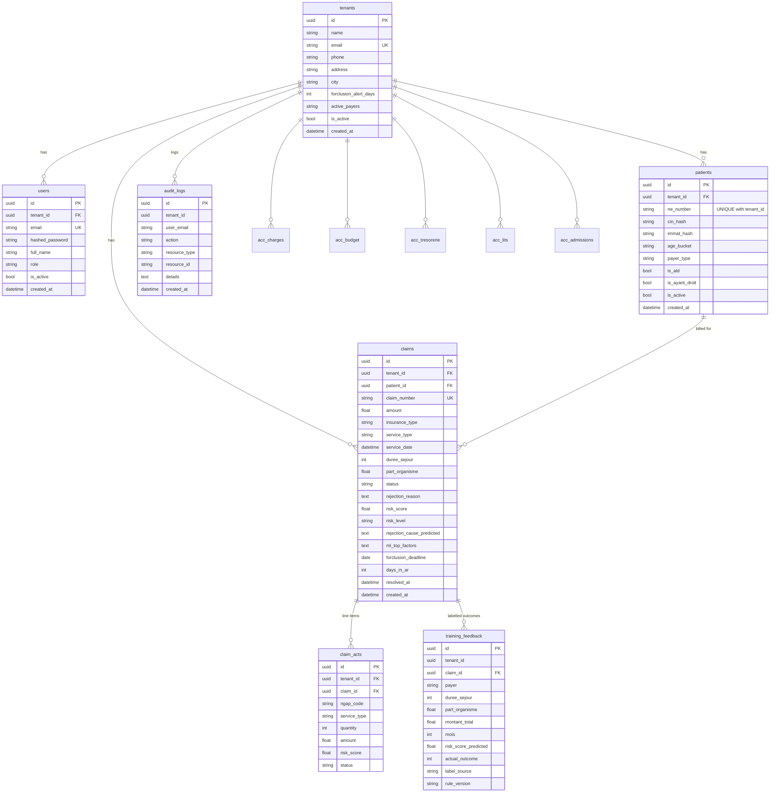

# Data model

PostgreSQL (Supabase). Two kinds of tables:

- **ORM tables**, defined in `backend/app/models/` and created at startup by `Base.metadata.create_all`: `tenants`, `users`, `patients`, `claims`, `claim_acts`.
- **Raw-SQL tables**, used through `sqlalchemy.text()` and created by hand in Supabase: `training_feedback`, `audit_logs`, `acc_charges`, `acc_budget`, `acc_tresorerie`, `acc_lits`, `acc_admissions`. Their columns below are **inferred from the queries in the code**. There is no DDL or migration in the repository, so types are indicative.

Every business table carries `tenant_id`, and every query filters on the tenant from the JWT.

## ER diagram

## Tables

### tenants (ORM)
One row per hospital or clinic. Created by `/auth/register`.
- `forclusion_alert_days`: how many days before the deadline to warn (default 7).
- `active_payers`: comma-separated list for settings (default `CNOPS,CNSS,AMO,AMO-Tadamon`).

### users (ORM)
Accounts belonging to a tenant.
- `email`: unique across the platform.
- `role`: `admin`, `director`, `chef_baf`, `biller` (default) or `agent`.
- Passwords are bcrypt hashes.

### patients (ORM)
A pseudonymous patient, never a named person.

| Column | Notes |
|---|---|
| `ne_number` | Hospital *Numéro d'Entrée*; unique per tenant (`uq_tenant_ne`) |
| `cin_hash`, `immat_hash` | Salted SHA-256 of CIN / insurance number, if provided; the clear values are never stored |
| `age_bucket` | `0-17`, `18-40`, `41-60`, `60+` |
| `payer_type` | CNOPS, CNSS, FAR, AMO, AMO-Tadamon |
| `is_ald`, `is_ayant_droit` | Long-term illness / dependant flags |

### claims (ORM)
One billing dossier.

| Group | Columns |
|---|---|
| Identity | `claim_number` (unique), `patient_id`, `tenant_id` |
| Billing | `amount` (MAD), `insurance_type`, `service_type`, `service_date`, `duree_sejour`, `part_organisme` |
| Status | `status`: `pending` → `approved` / `rejected` / `contested` / `settled` / `closed` / `abandoned`; plus `rejection_reason`, `rejection_code`, `submitted_at`, `resolved_at` |
| ML | `risk_score` (0–1), `risk_level` (FAIBLE/MODÉRÉ/ÉLEVÉ), `ml_top_factors` (JSON string of the top-3 SHAP factors), `rejection_cause_predicted` (French action). `denial_probability` is a legacy column that isn't written anymore. |
| Forclusion | `forclusion_deadline` (= service date + 60 days), `days_in_ar` (days since service at creation time) |

### claim_acts (ORM)
Optional line items of a claim: NGAP code, quantity, amount, quality flags (`ngap_coding_valid`, `prescription_legible`, `pec_required`, `pec_obtained`) and per-act ML fields. The schema exists, but **no endpoint writes to it yet**.

### training_feedback (raw SQL)
The labelled outcome dataset for future retraining. One row per status change, written by `PATCH /claims/{id}/status`.

| Column | Notes |
|---|---|
| `id`, `tenant_id`, `claim_id` | |
| `payer`, `service_type` | |
| `duree_sejour`, `part_organisme`, `montant_total`, `mois` | Model inputs at resolution time |
| `days_since_service`, `days_to_resolution` | |
| `risk_score_predicted` | Score given before the outcome was known |
| `actual_outcome` | 1 = rejected, 0 = any other outcome |
| `rejection_reason` | |
| `resolved_at` | `now()` at insert |
| `label_source` | `BAF_INTERNAL` |
| `rule_version` | `2026-01`; versions the labelling rules |

Rows are deleted when their claim or patient is deleted.

### audit_logs (raw SQL)
Append-only event log, read by `/audit/logs` (latest 200).
- Columns: `id`, `tenant_id`, `user_email`, `action`, `resource_type`, `resource_id`, `details`, `created_at`.
- Written on claim status changes and on claim or patient deletion.

### Accounting tables (raw SQL)
Monthly data for the *Comptabilité DAF* module. `periode` is `YYYY-MM`.

| Table | Columns used | Written by |
|---|---|---|
| `acc_charges` | `tenant_id, periode, categorie, sous_categorie, montant, description` | `POST /comptabilite/charges` |
| `acc_tresorerie` | `id, tenant_id, periode, tresorerie_actif, tresorerie_passif, actif_circulant, passif_circulant, created_at, updated_at` | `POST /comptabilite/tresorerie` (upsert) |
| `acc_admissions` | `id, tenant_id, periode, nb_admissions, nb_journees, ca_total, created_at` | `POST /comptabilite/admissions` (upsert) |
| `acc_budget` | `tenant_id, periode, categorie, montant_prevu` | Read only (no endpoint writes it) |
| `acc_lits` | `tenant_id, periode, service, nb_lits_total, nb_lits_occupes, nb_journees_total` | Read only (no endpoint writes it) |

## Not in the repository

- DDL for the raw-SQL tables. `TODO`: export the Supabase schema into a `db/schema.sql` or migrations.
- A migration tool (Alembic or Supabase migrations).
